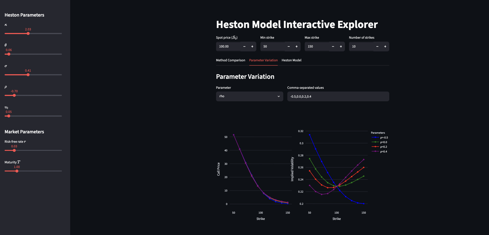

# Heston Model Toolbox

A quantitative-finance toolbox for pricing and calibrating European options under the **Heston stochastic volatility model** — implementing four independent pricing methods, a full market-data calibration pipeline and an interactive web app for real-time parameter exploration.

**🔗 Live demo:** [heston-model.streamlit.app](https://heston-model.streamlit.app/)




## Overview

The [Heston model](https://en.wikipedia.org/wiki/Heston_model) extends Black–Scholes by treating volatility as a mean-reverting stochastic process, letting it reproduce the volatility smile/skew seen in real markets. This toolbox prices options under Heston using **four different numerical approaches**, cross-checks them against one another, and calibrates the model to live option-chain data.

The asset price and its variance evolve as:


$$dS_t = \mu S_t \, dt + \sqrt{v_t}\, S_t \, dW_t^{(1)}$$
$$dv_t = \kappa(\theta - v_t)\, dt + \sigma \sqrt{v_t}\, dW_t^{(2)}$$
$$\text{corr}\left(dW_t^{(1)}, dW_t^{(2)}\right) = \rho$$


where $\kappa$ is the mean-reversion speed, $\theta$ the long-run variance, $\sigma$ the vol-of-vol, $\rho$ the correlation, and $v_0$ the initial variance.

# Key features

- **Four pricing methods** implemented from scratch and benchmarked against each other
- **Interactive Streamlit app** with sliders for live parameter sensitivity analysis
- **End-to-end calibration pipeline** fitting Heston parameters to real AAPL/MSFT option chains
- **Nelson–Siegel–Svensson** yield-curve fitting for a realistic risk-free term structure
- **Live market data ingestion** from Yahoo Finance
- Clean, reusable Python modules plus annotated notebooks with the full mathematical derivations

## Pricing methods

| Method | File | Approach | Notes |
| --- | --- | --- | --- |
| **Heston (1993) semi-analytic** | `heston/P1P2Heston.py` | Characteristic-function inversion via numerical integration (`C = S₀·P₁ − K·e^(−rτ)·P₂`) | The original closed-form solution |
| **COS method** | `heston/CosMethodHeston.py` | Fourier-cosine series expansion of the discounted payoff | Fast and highly accurate |
| **Monte Carlo** | `heston/MonteCarloHeston.py` | Euler–Maruyama and Almost-Exact (AES) schemes; AES samples the CIR variance exactly via non-central χ² | Flexible, extensible to exotics |
| **QuantLib** | `heston/QuantlibHeston.py` | Wrapper around QuantLib's `AnalyticHestonEngine` | Independent reference/benchmark |

A **Black–Scholes** module (`BlackScholes/`) provides closed-form pricing and implied-volatility solving (Brent's method and Newton–Raphson) used for the implied-vol surfaces.

## Project structure

```
HestonModelToolbox/
├── HestonPriceApp.py            # Streamlit app (entry point)
├── PriceCalibration.ipynb       # Market-data calibration pipeline
├── SaveMarketData.ipynb         # Pulls live option chains from Yahoo Finance
├── heston/                      # Core pricing engine (4 methods)
│   ├── P1P2Heston.py
│   ├── CosMethodHeston.py
│   ├── MonteCarloHeston.py
│   └── QuantlibHeston.py
├── BlackScholes/                # BS pricing + implied volatility
│   ├── BSprice.py
│   └── Vega_iv.py
├── Heston_pricing_notebooks/    # Annotated notebooks with full derivations
├── option_data/                 # Sample AAPL / MSFT option-chain CSVs
└── requirements.txt
```

### Price an option directly

```python
from heston.P1P2Heston import heston_call_price

price = heston_call_price(
    S0=100, K=100, r=0.05, tau=1.0,
    kappa=2.0, theta=0.05, sigma=0.3, rho=-0.5, v0=0.05,
)
print(f"Call price: {price:.4f}")
```

### Calibrate to market data

1. Run `SaveMarketData.ipynb` to fetch a fresh option chain (or use the bundled CSVs in `option_data/`).
2. Run `PriceCalibration.ipynb` to fit the five Heston parameters by minimizing pricing error (SLSQP optimizer with a Feller-condition constraint, `2κθ > σ²`) and visualize the market-vs-model price surface in 3D.

## Tech stack

`Python` · `NumPy` · `SciPy` · `pandas` · `QuantLib` · `Plotly` · `Streamlit` · `yfinance` · `nelson-siegel-svensson`


## References

- Heston, S. L. (1993). *A Closed-Form Solution for Options with Stochastic Volatility with Applications to Bond and Currency Options.* [PDF](https://www.ma.imperial.ac.uk/~ajacquie/IC_Num_Methods/IC_Num_Methods_Docs/Literature/Heston.pdf)
- Fang, F. & Oosterlee, C. W. (2008). *A Novel Pricing Method for European Options Based on Fourier-Cosine Series Expansions.* (the COS method)
- [Heston model — Wikipedia](https://en.wikipedia.org/wiki/Heston_model)
